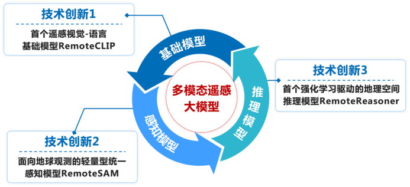
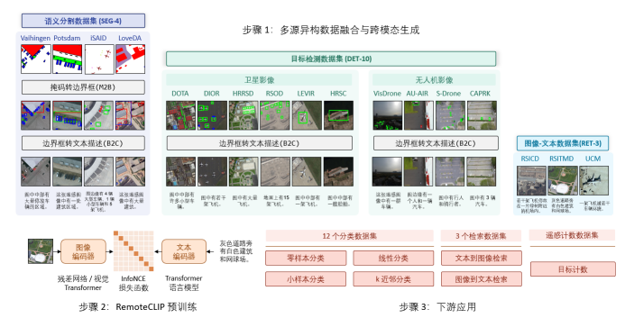
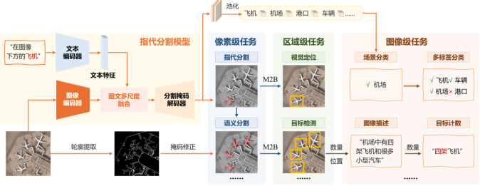
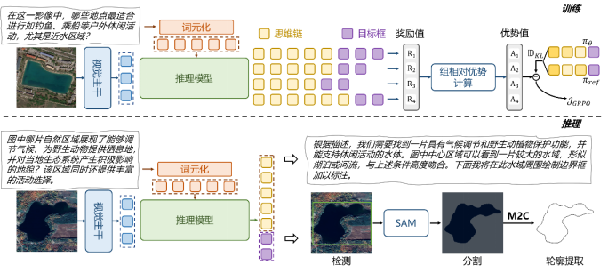

我校计算机与软件学院刘凡教授团队围绕“基础模型-感知模型-推理模型” 研究思路，在遥感视觉语言大规模预训练、多粒度任务统一感知建模、强化学习驱动的地理空间推理等方面取得系列研究成果。相关成果发表在计算机领域顶级会议《ACM International Conference on Multimedia》及《Annual AAAI Conference on Artificial Intelligence》与遥感领域权威期刊《IEEE Transactions on Geoscience and Remote Sensing》上。具体研究进展如下：

**1. 构建了首个遥感视觉-语言基础模型RemoteCLIP**

团队深入分析了现有自监督学习和掩码图像建模在处理高层语义任务时的局限性，提出了首个遥感视觉-语言基础模型RemoteCLIP，研发了多源异构的数据扩展技术，解决了多模态遥感数据标注数量少、成本高、语义不对齐等问题。多模态遥感数据体系规模超同期数据集10倍，检索性能提升超10%，论文入选ESI热点论文。

**2. 提出了面向地球观测的轻量型统一感知模型 RemoteSAM**

为解决遥感难以兼容多种视觉任务的问题，团队研发了统一多视觉任务的轻量型感知模型RemoteSAM，在一个模型中同时支持分类、检测、分割和定位等8种遥感任务。不同于以往依赖特定任务头微调或基于大语言模型的文本生成范式，该研究提出了一种以“指代分割”任务为核心的统一架构。模型以像素级掩码作为基础计算单元，能够无缝转换为检测框、类别标签或计数结果。RemoteSAM以更小的参数量（180M）在多个基准测试中超越了Falcon、GeoChat等七十亿（7B）参数级模型，实现了高效、高精度的统一感知。

**3. 研发了首个强化学习驱动的地理空间推理模型RemoteReasoner**

针对遥感解译中用户意图模糊、地理空间关系复杂的难题，团队提出了首个强化学习驱动的地理空间推理模型RemoteReasoner。该研究打破了传统监督微调的限制，首次引入群组相对策略优化算法进行强化学习训练，赋予了模型自主探索推理路径的能力，仅需一次推理即可同时支持区域级、像素级和目标级的多粒度推理任务。RemoteReasoner在区域级推理任务上超越现有模型精度34%，并在未见过的任务和类别上展现了卓越的泛化能力。

上述研究工作主要由我校计算机与软件学院刘凡教授、2025级博士生姚亮等共同完成，得到了国家自然科学基金、江苏省优秀青年基金、装备预研教育部联合基金等项目的资助。相关模型与数据已开源，为推动遥感大模型技术发展提供了理论与技术支撑。

**代表性文献成果：**

[1]Liu F, Chen D, Guan Z, et al. RemoteCLIP: A Vision Language Foundation Model for Remote Sensing[J]. IEEE Transactions on Geoscience and Remote Sensing, 2024, 62: 1-16. 
[2]Yao L, Liu F, Chen D, et al. RemoteSAM: Towards Segment Anything For Earth Observation[C]//ACM International Conference on Multimedia. 2025: 3027-3036. 
[3]Yao L, Liu F, Lu H, et al. RemoteReasoner: Towards Unifying Geospatial Reasoning Workflow[C]//Annual AAAI Conference on Artificial Intelligence. 2026.
[4]Yao L, Liu F, Xu S, et al. UEMM-Air: Enable UAVs to Undertake More Multi-modal Tasks[C]//ACM International Conference on Multimedia. 2025：12792-12798.